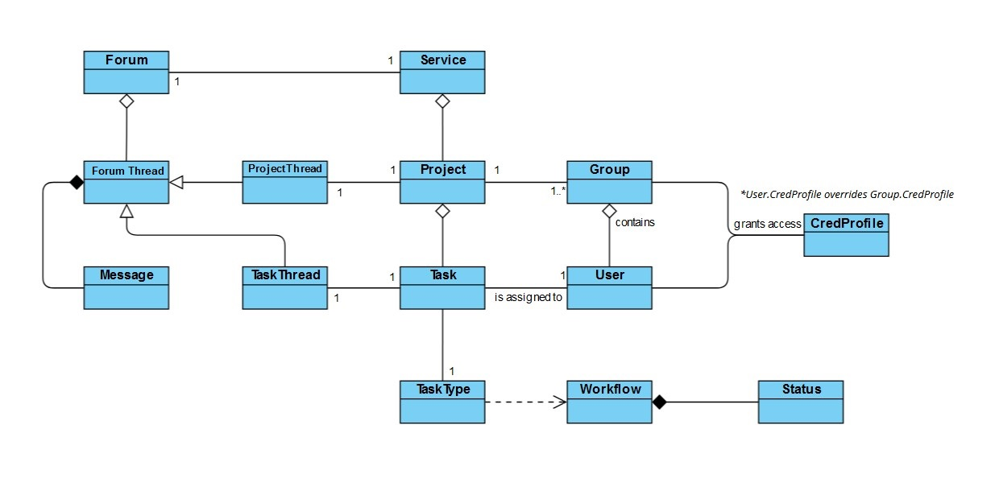

# DIAGRAM KLAS + OBJAŚNIENIA
(wersja wstępna)

**Service** 	- usługa obsługująca aplikację wraz z komponentami sieciowymi i obsługą bazy projektów oraz forum 
**Project** 	- projekty zamieszczone na i śledzone z użyciem aplikacji, posiada przypisanych użytkowników grupę (grupy) prowadzące jego rozwój i posiadających dostęp do powiązanych wątków na forum
**Task**	- zadanie przynależne do określonego projektu, z przypisanym mu użytkownikiem (asignee), oraz wątkiem na forum
**TaskType**	- rodzaj zadania (feature, bug, etc.) określający jego schemat przebiegu
	**Workflow**		- schemat przebiegu zadania z uwzględnieniem przejść między statusami zadania
	**Status**		- pojedyńczy stan określający stadium wykonania/wdrożenia zadania
**Forum**	- całość panelu służącego do komunikacji pomiędzy użytkownikami serwisu, z wątkami otwartymi oraz zamkniętymi wątkami wewnątrz projektów
**Thread**	- wątek na forum z uwzględnieniem tematu, wpisów, oraz kluczem profilu dostępu przez użytkowników
	**ProjectThread**	- wątek zawierający specyficzny format przeznaczony dla odpowiedniego projektu
	**TaskThread**		- wątek o formacie czatu, otwierany i zamykany w odpowiedzi na utworzenie i zamknięcie przypisanego zadania
**Message**	- wpis w wątku na forum posiadający czas dodania oraz dane dodającego użytkownika
**User**	- użytkownik serwisu, posiadający dostępy do projektów, do których dołączył
**Group**	- grupa użytkowników posiadająca dostępy do określonych projektów
**CredProfile**	- profil dostępów posiadanych poszczególnych użytkowników jak i grupy, do których należą - uprawnienia użytkownika rozszerzają uprawnienia grup, do których należy
